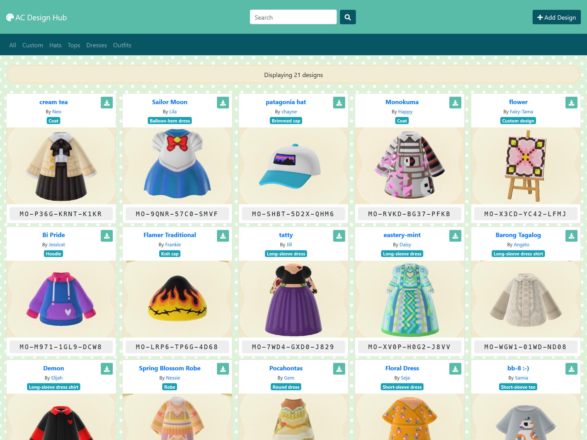
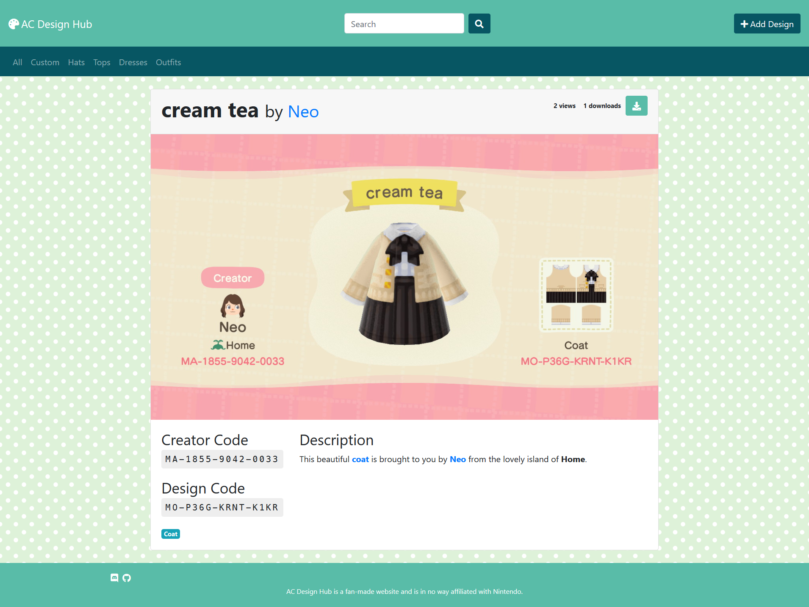
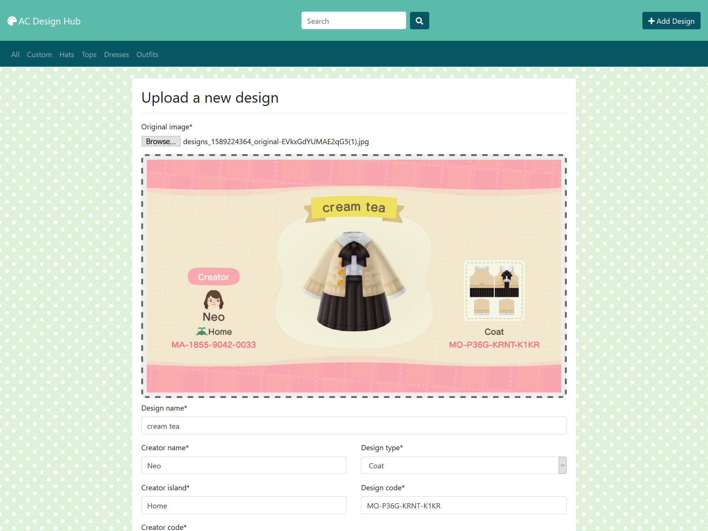

# AC Design Hub

The goal of this app is to create a repository of searchable Animal Crossing designs.

Users will be able to upload screenshot of a custom design, which will then be automatically tagged with the creator code, design code, design type, and design title.

Users will then be able to add custom tags, such as `sign`, `ground scatter`, `path`, `path border`, `wall art`, `flower`, `moss`, `face paint`, `eyebrows`, `museum`, `fish`, etc.







## Setup

Create and activate a virtualenv

Then run:
```
$ ./bin/setup
```

Test DB available in `cypress/fixtures/test_db`

Login is `admin`/`admin`

## Features

### Todo

- [ ] add pagination to index page
- [ ] implement search functionality
- [ ] implement sort functionality
  - [ ] `date_added`
  - [ ] `view_count`
  - [ ] `download_count`
  - [ ] `design_name`?
- [ ] limit fields required for submission
  - [ ] `original_image`
  - [ ] `creator_code`
  - [ ] `design_code`
- [ ] auto-crop square design thumbnail from screenshot
  - [ ] display alternate thumbnail on hover on index page
  - [ ] display alternate thumbnail on design detail page
- [ ] allow users to tag designs with pre-defined tags
  - [ ] types [`sign`, `stall`, `path`, `border`, `ground`, `flower`, `wall art`, `pattern`]
  - [ ] colors [`red`, `orange`, `yellow` , `green` , `blue`, `purple`, `pink`, `white`, `black`, `brown`, `multi`, `rainbow`]
  - [ ] display tags on design detail page
- [ ] allow users to upload additonal screenshots of design applied in-game (demo example use)
  - [ ] indicate additonal images from index page (icon on image corner?)
  - [ ] display additional images on design detail page
- [ ] Implement user accounts
  - [ ] allow users to create an account
  - [ ] allow users to favorite designs
  - [ ] allow sorting designs by number of favorites
- [ ] Implement moderators?
