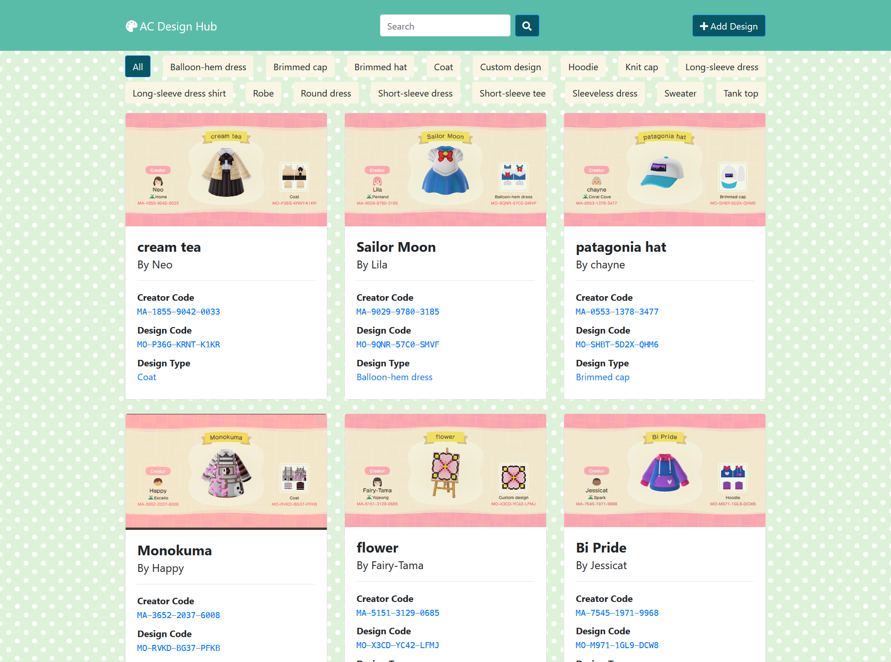
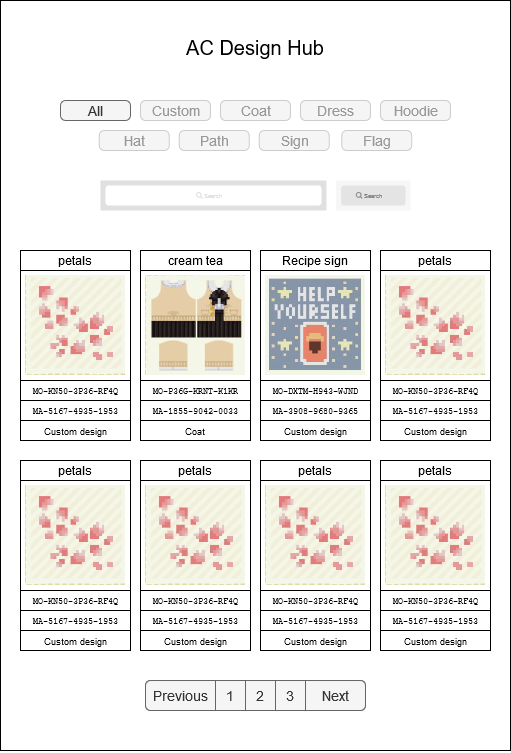
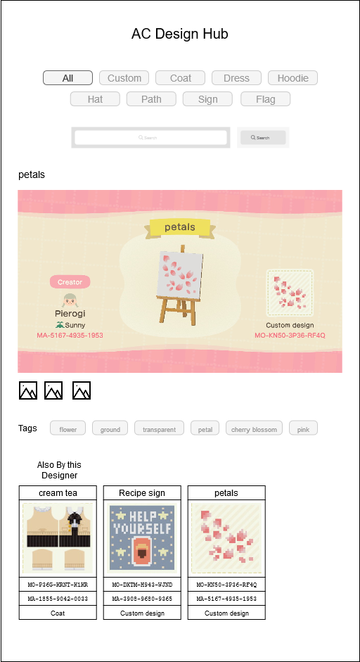

# AC Design Hub

The goal of this app is to create a repository of searchable Animal Crossing designs.

Users will be able to upload screenshot of a custom design, which will then be automatically tagged with the creator code, design code, design type, and design title.

Users will then be able to add custom tags, such as `sign`, `ground scatter`, `path`, `path border`, `wall art`, `flower`, `moss`, `face paint`, `eyebrows`, `museum`, `fish`, etc.







## Setup

Create and activate a virtualenv

Then run:
```
$ ./bin/setup
```

Test DB available in `cypress/fixtures/test_db`

Login is `admin`/`admin`

## Features

### Todo

- [x] add image thumbnails for admin
- [x] add approve button for admin
- [x] export test database
- [x] add download count per design
- [x] add view count per design
- [ ] improve tesseract.js OCR
  - [ ] add rectangles to OCR
- [ ] auto crop image thumbnail
- [ ] add pagination to `/` route
- [x] add `/design/<design_code>` route
- [ ] allow uploading additonal images
- [ ] implement search functionality
- [ ] limit fields required for submission
  - [ ] original_image
  - [ ] creator_code
  - [ ] design_code

### MVP

#### Image Upload

- [x] allow users to upload a screenshot of an AC Design
- [ ] OCR the image for the following info:
  - design title
  - creator name
  - creator island name
  - design type (custom design, coat, hoodie, balloon-hem dress, etc)
  - creator code `MA-XXXX-XXXX-XXXX`
  - design code `MO-XXXX-XXXX-XXXX`
- [ ] auto-fill submission form with OCR data
- [ ] require users to crop square design thumbnail from screenshot
- [ ] allow users to add arbitrary tags (`sign`, `flower`, `pink`, `cherry blossom`, `path`, etc)

#### Design Search

- [x] display gallery of all designs
- [ ] allow users to search designs that have been uploaded by any field value
- [x] display designs grouped by design type (`custom design`, `coat`, `hoodie`, `ballon-hem dress`, etc)
- [ ] display designs that match a given term
- [x] display designs with a certain creator code
- [x] allow users to click a creator code to see all designs by
that creator

#### General

- [x] display contact info in site footer to allow reporting site issues

### Features for Later

#### Design Detail Page
- [x] allow users to click a design thumbnail to see a detailed page
- detailed page should show:
  - [x] original screenshot
  - [ ] additional images (ex. screenshot of design applied in-game)
  - [ ] tags associated with the design (click a tag to view all designs with that tag)
  - [x] thumbnails of other designs with the same creator code
  - [ ] thumbnails of similar designs?
- [ ] allow users to upload additonal screenshots of design applied in-game (demo example use)

#### Account
- [ ] allow users to create an account
- [ ] allow users to favorite designs
- [ ] allow sorting designs by popularity (views? favorites?)
